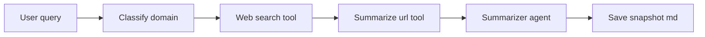
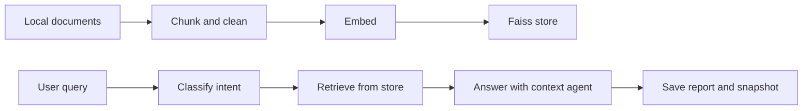
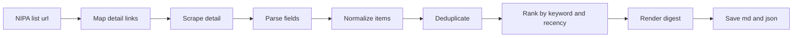
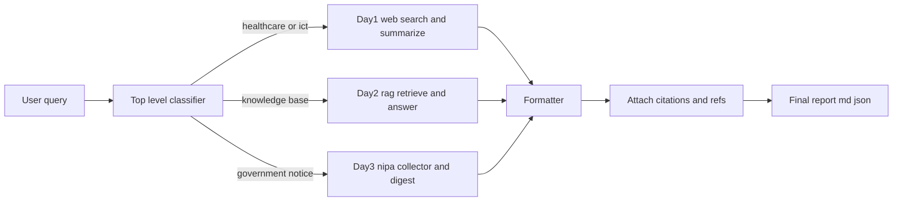

## Day 1 flow — classify → web search → url summarize

**핵심 역할**

* Classify domain: 질의 도메인 라벨링(healthcare, ict, etc)
* Web search tool: Tavily 검색 결과 수집
* Summarize url tool: Firecrawl 우선, 실패 시 requests 로 본문 확보
* Summarizer agent: 3~5 불릿 요약
* Save snapshot: 콘솔 및 md 저장

---

## Day 2 flow — local rag ingest → retrieve → answer

**핵심 역할**

* Chunk and clean: 파일 폴더 전체 스캔, 청크 생성
* Embed: 임베딩 계산 후 저장
* Faiss store: 재사용 가능한 로컬 벡터 스토어
* Retrieve: 질의 임베딩으로 TopK 검색
* Answer with context: 컨텍스트 기반 답변(간단 보고서 형태)

---

## Day 3 flow — government notices from nipa

**핵심 역할**

* Map detail links: 목록에서 상세 공고 url만 수집
* Scrape detail: 본문과 링크 수집(Firecrawl 우선, 폴백 지원)
* Parse fields: 공고일, 마감일, 기관, 예산, 요구사항, 첨부 추출
* Normalize, Deduplicate: 공통 스키마 정리 및 중복 제거
* Rank: 키워드 OR 점수 + 최근성 가점
* Render digest: 텍스트형은 요약 불릿, 첨부형은 링크 중심
* Save: md 리포트 + json 다이제스트 저장

---

## Day 4 router flow — combine day1 to day3

**조합 원리**

* **Top level classifier**: 질의를 상위 의도로 라우팅

  * `healthcare / ict 등 정보성` → **Day1**(웹검색+URL요약)
  * `사내자료 기반 질의` → **Day2**(RAG 검색+답변)
  * `사업공고 탐색` → **Day3**(NIPA 수집+Digest)
* **Formatter**: 출력 스키마 통일(제목, 메타, 본문, 불릿, 표)
* **Citations**: Day1 결과 url, Day2 근거 문서, Day3 공고 원문·첨부 링크 인용
* **Final output**: 하나의 md/json으로 최종 리포트 생성
