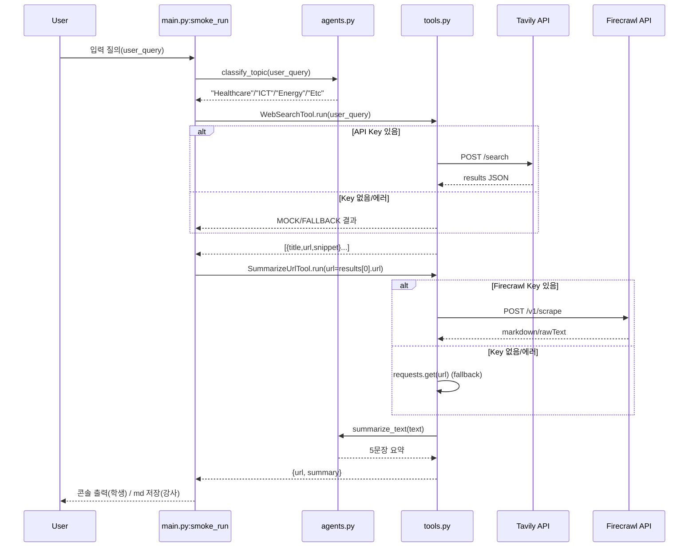

```mermaid
sequenceDiagram
  participant User
  participant Main as main.py:smoke_run
  participant Agents as agents.py
  participant Tools as tools.py
  participant Tavily as Tavily API
  participant Firecrawl as Firecrawl API

  User->> Main: 입력 질의(user_query)
  Main->> Agents: classify_topic(user_query)
  Agents-->> Main: "Healthcare"/"ICT"/"Energy"/"Etc"

  Main->>Tools: WebSearchTool.run(user_query)
  alt API Key 있음
    Tools->>Tavily: POST /search
    Tavily-->>Tools: results JSON
  else Key 없음/에러
    Tools-->>Main: MOCK/FALLBACK 결과
  end
  Tools-->>Main: [{title,url,snippet}...]

  Main->>Tools: SummarizeUrlTool.run(url=results[0].url)
  alt Firecrawl Key 있음
    Tools->>Firecrawl: POST /v1/scrape
    Firecrawl-->>Tools: markdown/rawText
  else Key 없음/에러
    Tools->>Tools: requests.get(url) (fallback)
  end
  Tools->>Agents: summarize_text(text)
  Agents-->>Tools: 5문장 요약
  Tools-->>Main: {url, summary}

  Main-->>User: 콘솔 출력(학생) / md 저장(강사)
```