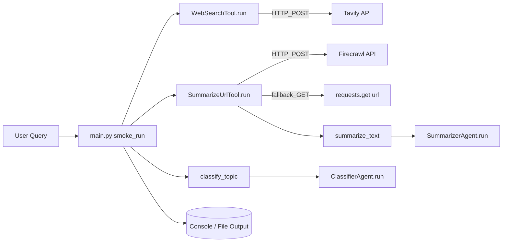

```mermaid
graph LR
  U[User Query] --> M[main.py smoke_run]
  M --> C[classify_topic]
  M --> S[WebSearchTool.run]
  S --> |HTTP_POST| T[Tavily API]
  M --> SU[SummarizeUrlTool.run]
  SU --> |HTTP_POST| F[Firecrawl API]
  SU --> |fallback_GET| G[requests.get url]
  SU --> SUM[summarize_text]
  SUM --> A1[SummarizerAgent.run]
  C --> A2[ClassifierAgent.run]
  M --> O[(Console / File Output)]
```