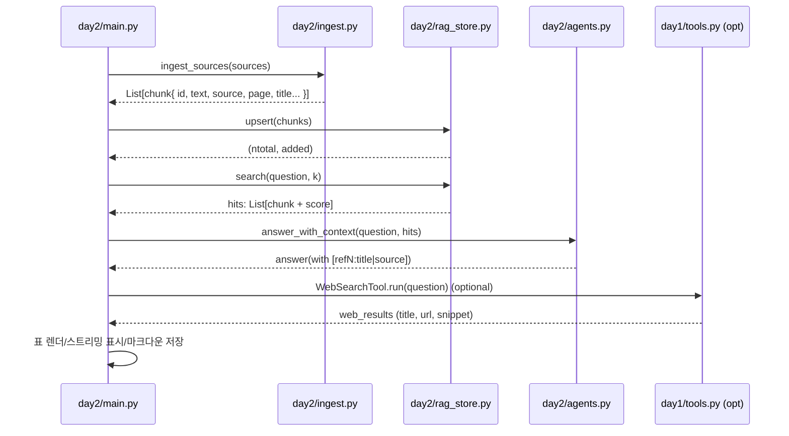

```mermaid
sequenceDiagram
    participant Main as day2/main.py
    participant Ingest as day2/ingest.py
    participant Store as day2/rag_store.py
    participant Agent as day2/agents.py
    participant Day1 as day1/tools.py (opt)
    
    Main->>Ingest: ingest_sources(sources)
    Ingest-->>Main: List[chunk{ id, text, source, page, title... }]

    Main->>Store: upsert(chunks)
    Store-->>Main: (ntotal, added)

    Main->>Store: search(question, k)
    Store-->>Main: hits: List[chunk + score]
    %% 반환: {"id", "title", "url", "source", "summary", "text", "page", "kind", "score"}
    
    Main->>Agent: answer_with_context(question, hits)
    Agent-->>Main: answer(with [refN:title|source])

    Main->>Day1: WebSearchTool.run(question) (optional)
    Day1-->>Main: web_results (title, url, snippet)

    Main->>Main: 표 렌더/스트리밍 표시/마크다운 저장
```