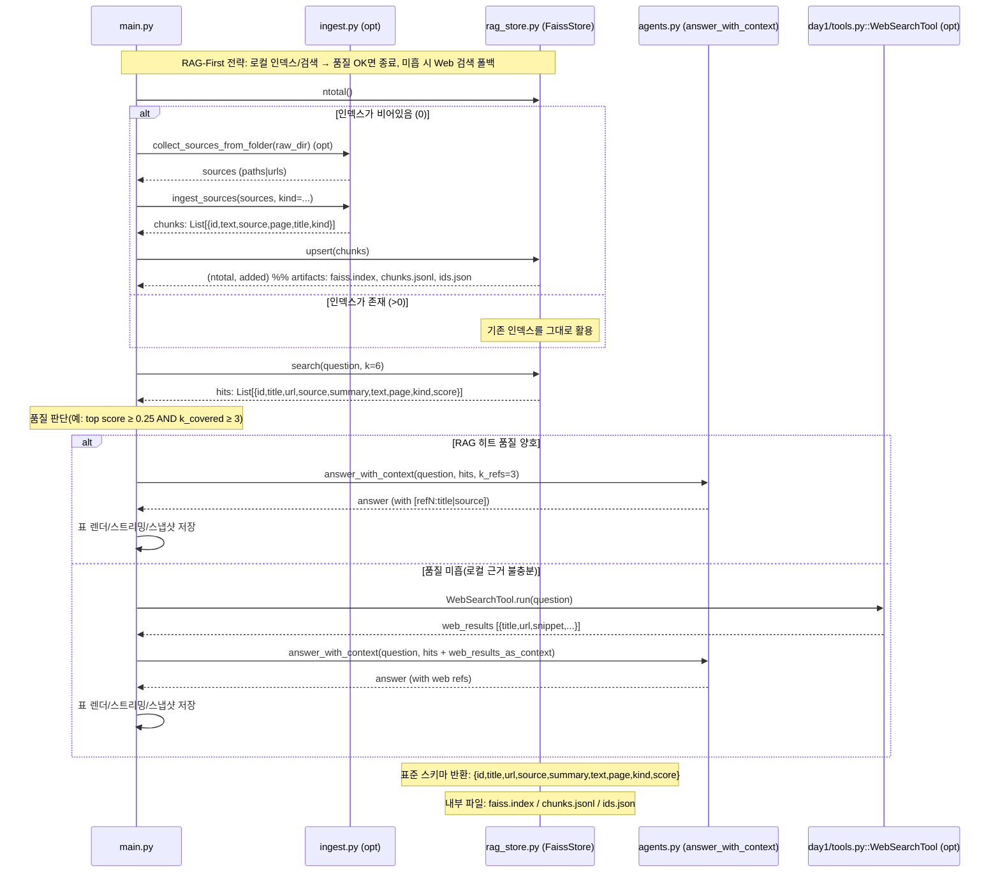

```mermaid
sequenceDiagram
    %% Participants (실제 리포 구조에 맞게 파일명만 교체하세요)
    participant Main as main.py
    participant Ingest as ingest.py (opt)
    participant Store as rag_store.py (FaissStore)
    participant Agent as agents.py (answer_with_context)
    participant Web as day1/tools.py::WebSearchTool (opt)

    Note over Main,Store: RAG-First 전략: 로컬 인덱스/검색 → 품질 OK면 종료, 미흡 시 Web 검색 폴백

    Main->>Store: ntotal()
    alt 인덱스가 비어있음 (0)
        Main->>Ingest: collect_sources_from_folder(raw_dir) (opt)
        Ingest-->>Main: sources (paths|urls)
        Main->>Ingest: ingest_sources(sources, kind=...)
        Ingest-->>Main: chunks: List[{id,text,source,page,title,kind}]
        Main->>Store: upsert(chunks)
        Store-->>Main: (ntotal, added)  %% artifacts: faiss.index, chunks.jsonl, ids.json
    else 인덱스가 존재 (>0)
        Note over Store: 기존 인덱스를 그대로 활용
    end

    Main->>Store: search(question, k=6)
    Store-->>Main: hits: List[{id,title,url,source,summary,text,page,kind,score}]

    Note over Main: 품질 판단(예: top score ≥ 0.25 AND k_covered ≥ 3)

    alt RAG 히트 품질 양호
        Main->>Agent: answer_with_context(question, hits, k_refs=3)
        Agent-->>Main: answer (with [refN:title|source])
        Main->>Main: 표 렌더/스트리밍/스냅샷 저장
    else 품질 미흡(로컬 근거 불충분)
        Main->>Web: WebSearchTool.run(question)
        Web-->>Main: web_results [{title,url,snippet,...}]
        Main->>Agent: answer_with_context(question, hits + web_results_as_context)
        Agent-->>Main: answer (with web refs)
        Main->>Main: 표 렌더/스트리밍/스냅샷 저장
    end

    Note over Store: 표준 스키마 반환: {id,title,url,source,summary,text,page,kind,score}
    Note over Store: 내부 파일: faiss.index / chunks.jsonl / ids.json
```