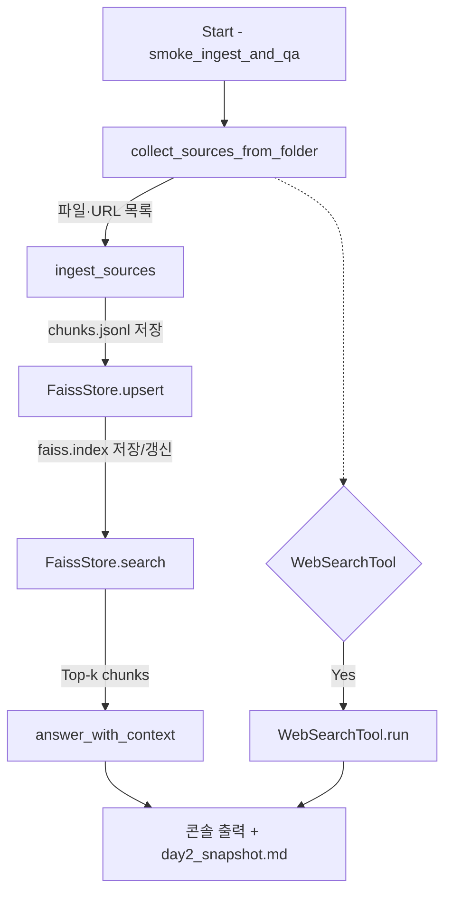

```mermaid
flowchart TD
    A[Start - smoke_ingest_and_qa] --> B[collect_sources_from_folder]
    B -->|파일·URL 목록| C[ingest_sources]
    C -->|chunks.jsonl 저장| D[FaissStore.upsert]
    D -->|faiss.index 저장/갱신| E[FaissStore.search]
    E -->|Top-k chunks| F[answer_with_context]
    F --> G[콘솔 출력 + day2_snapshot.md]
    B -.-> H{WebSearchTool}
    H -- Yes --> I[WebSearchTool.run]
    I --> G
```