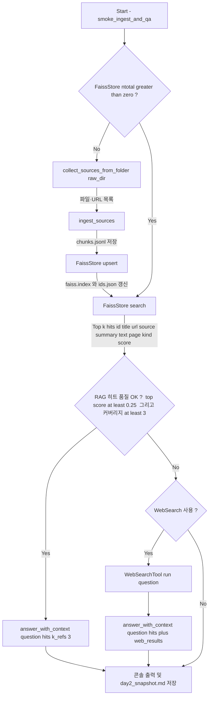

```mermaid
flowchart TD
    %% 시작
    A[Start - smoke_ingest_and_qa]

    %% 결정 노드: 괄호와 부등호 제거
    B{"FaissStore ntotal greater than zero ?"}

    %% 시작 → 분기
    A --> B

    %% 인덱스 준비 분기
    B -- No --> C[collect_sources_from_folder raw_dir]
    C -->|파일·URL 목록| D[ingest_sources]
    D -->|chunks.jsonl 저장| E[FaissStore upsert]
    E -->|faiss.index 와 ids.json 갱신| F[FaissStore search]

    B -- Yes --> F[FaissStore search]

    %% 검색 → 품질 판단
    F -->|Top k hits id title url source summary text page kind score| G{"RAG 히트 품질 OK ?  top score at least 0.25  그리고 커버리지 at least 3"}

    %% RAG-First 성공 경로
    G -- Yes --> H[answer_with_context question hits k_refs 3]
    H --> I[콘솔 출력 및 day2_snapshot.md 저장]

    %% RAG 미흡 → Web 폴백
    G -- No --> J{"WebSearch 사용 ?"}
    J -- Yes --> K[WebSearchTool run question]
    K --> L[answer_with_context question hits plus web_results]
    L --> I

    J -- No --> I

```