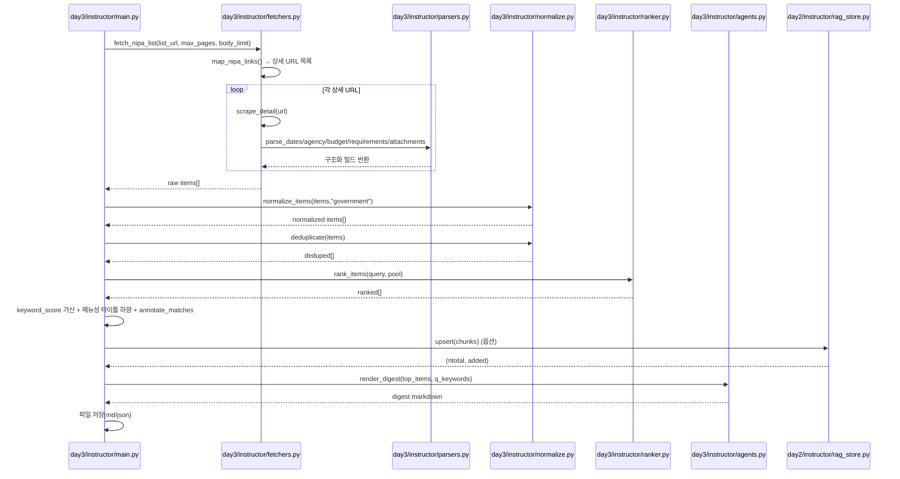

# `day3_file_flow.md` — 파일 간 흐름

```mermaid
sequenceDiagram
    participant Main as day3/instructor/main.py
    participant Fetch as day3/instructor/fetchers.py
    participant Parse as day3/instructor/parsers.py
    participant Norm as day3/instructor/normalize.py
    participant Rank as day3/instructor/ranker.py
    participant Agent as day3/instructor/agents.py
    participant Store as day2/instructor/rag_store.py

    Main->>Fetch: fetch_nipa_list(list_url, max_pages, body_limit)
    Fetch->>Fetch: map_nipa_links() → 상세 URL 목록
    loop 각 상세 URL
        Fetch->>Fetch: scrape_detail(url)
        Fetch->>Parse: parse_dates/agency/budget/requirements/attachments
        Parse-->>Fetch: 구조화 필드 반환
    end
    Fetch-->>Main: raw items[]
    Main->>Norm: normalize_items(items,"government")
    Norm-->>Main: normalized items[]
    Main->>Norm: deduplicate(items)
    Norm-->>Main: deduped[]
    Main->>Rank: rank_items(query, pool)
    Rank-->>Main: ranked[]
    Main->>Main: keyword_score 가산 + 메뉴성 타이틀 하향 + annotate_matches
    Main->>Store: upsert(chunks)  (옵션)
    Store-->>Main: (ntotal, added)
    Main->>Agent: render_digest(top_items, q_keywords)
    Agent-->>Main: digest markdown
    Main->>Main: 파일 저장(md/json)
```

---
