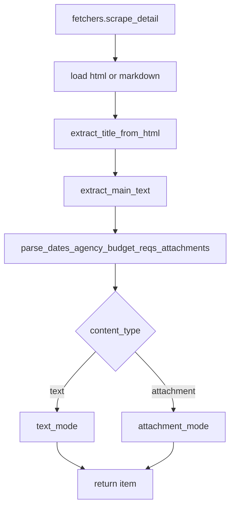

# `day3_flow.md` — Day3 전체 개념도

## 핵심 포인트

1. `main.py`의 `main()`이 **오케스트레이션**
2. **목록 수집(Map) → 상세 수집(Scrape) → 구조화 파싱 → 정규화/중복제거 → 랭킹 → Digest 생성 → (옵션) RAG 업서트** 순
3. 상세 페이지는 **텍스트형 vs 첨부형**을 자동 판별

   * 텍스트형: **본문 요약(불릿)** + 첨부(있으면 링크)
   * 첨부형: **첨부 링크 중심** + 본문 요약(있으면 1~2줄)
4. 사용자 질의에서 **핵심 키워드 추출** → 랭킹에 OR 가산 + `matched_fields` 표시
5. 결과는 **Markdown 스냅샷 + JSON 다이제스트**를 저장

---

## Mermaid (상위 흐름)

```mermaid
flowchart LR
    A[User Query] --> B[main.extract_keywords]
    B --> C[fetchers.map_nipa_links]
    C --> D[fetchers.scrape_detail N times]
    D --> E[parsers.parse_fields]
    E --> F[normalize.normalize_items]
    F --> G[normalize.deduplicate]
    G --> H[ranker.rank_items]
    H --> I[main.apply_keyword_score]
    I --> J[main.annotate_matches]
    J --> K[agents.render_digest]
    K --> L[(optional RAG upsert and search)]
    L --> M[save snapshot md and json]

```

---

## Mermaid (상세 처리 — 텍스트형/첨부형 분기)

---
